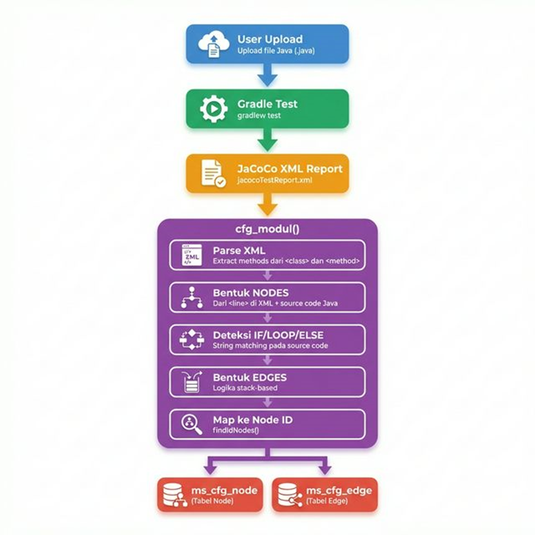

# Progress Report — Eksplorasi Kode Pembuatan Control Flow Graph (CFG)
**Tanggal:** 14 Februari 2026  
**Mata Kuliah:** Tugas Akhir — Semester 8  
**Proyek:** Software Testing Web App (Backend)

---

## 1. Tujuan Eksplorasi

Memahami secara menyeluruh bagaimana sistem **membentuk Control Flow Graph (CFG)** dari source code Java yang di-upload oleh user, mulai dari titik awal hingga akhir proses.

---

## 2. Struktur File yang Terlibat dalam Proses CFG

| No | File | Peran |
|----|------|-------|
| 1 | `routes/modul.py` | File utama yang berisi seluruh logika pembuatan CFG |
| 2 | `models/node.py` | Model tabel `ms_cfg_node` — menyimpan node CFG |
| 3 | `models/edge.py` | Model tabel `ms_cfg_edge` — menyimpan edge CFG |
| 4 | `models/tr_node.py` | Model tabel `tr_cfg_node` — tracking coverage node per siswa |
| 5 | `models/tr_edge.py` | Model tabel `tr_cfg_edge` — tracking coverage edge per siswa |
| 6 | `models/modul.py` | Model tabel `ms_modul_program` — data modul program |
| 7 | `utilities/graphUtil.py` | Utility class `Graph` untuk pencarian semua path (belum terintegrasi di alur utama) |

---

## 3. Alur Proses Pembuatan CFG (Secara Runtut)

<div style="text-align: center;">
  
</div>

### Langkah 1: User Upload Source Code Java
- **Fungsi:** `upload()` di `routes/modul.py` (baris 306–377)
- **Endpoint:** `POST /modul/uploadSourceCode/{id_modul}`
- **Proses:**
  - File Java disimpan ke folder `modules/{id_modul}/`
  - Data nama file diupdate ke tabel `ms_modul_program`

### Langkah 2: Menjalankan Gradle Test (JaCoCo)
- Masih di dalam fungsi `upload()`
- **Proses:**
  - Menyiapkan folder `engine-testing/{id_modul}/` dengan template dari `jacoco-engine/`
  - Meng-copy source code Java ke folder `src/main/java/`
  - Menjalankan perintah `gradlew test` via `subprocess`
  - Jika `BUILD SUCCESSFUL`, meng-copy report JaCoCo ke `modules/{id_modul}/jacoco_report_test/`

### Langkah 3: Memanggil Fungsi `cfg_modul()`
- **Fungsi:** `cfg_modul()` di `routes/modul.py` (baris 121–297)
- Dipanggil dari `upload()` di baris 362:
  ```python
  result = await cfg_modul(request, id_modul)
  ```

### Langkah 4: Parsing JaCoCo XML Report (di dalam `cfg_modul`)
- **Baris 129–157**
- **Proses:**
  - Membuka file `jacocoTestReport.xml` hasil JaCoCo
  - Membaca source code Java asli
  - Mengekstrak daftar method dari tag `<class>` → `<method>` di XML
  - Menyimpan informasi `start_line` dan `end_line` setiap method

### Langkah 5: Pembentukan Node (di dalam `cfg_modul`)
- **Baris 159–174**
- **Sumber data:** Tag `<line>` di dalam `<sourcefile>` pada JaCoCo XML
- **Proses:**
  - Setiap baris yang terdeteksi oleh JaCoCo menjadi satu node
  - Setiap node memiliki: `id_node` (UUID), `line_number`, dan `code` (isi baris source code)
  - Node dikelompokkan per method berdasarkan range `start_line` — `end_line`

### Langkah 6: Deteksi Statement IF/LOOP/ELSE (di dalam `cfg_modul`)
- **Baris 176–206**
- **Sumber data:** Isi source code Java (bukan dari XML)
- **Metode:** String matching + Stack-based tracking
- **Proses:**
  - Mengiterasi setiap node, membaca isi kode dari source code Java
  - Jika baris mengandung `if (` → push ke stack sebagai statement "if"
  - Jika baris mengandung `for` atau `while` → push ke stack sebagai statement "loop"
  - Jika baris berikutnya mengandung `}` → pop dari stack, tandai node dengan `startIf` atau `startLoop`

### Langkah 7: Pembentukan Edge (di dalam `cfg_modul`)
- **Baris 208–245**
- **Logika:**
  - **Statement biasa:** edge sequential dari `prevNode` ke `currentNode`
  - **Akhir blok IF:** 2 edge — dari node IF ke blok else, dan dari node IF ke statement setelahnya
  - **Akhir blok LOOP:** 2 edge — dari `prevNode` ke `currentNode`, dan back-edge dari `currentNode` kembali ke awal loop

### Langkah 8: Mapping Edge ke Node ID
- **Baris 246–259**
- **Fungsi helper:** `findIdNodes()` (baris 299–304)
- **Proses:** Mengkonversi edge yang berisi `line_number` menjadi edge yang berisi `id_node` (UUID)

### Langkah 9: Simpan ke Database
- **Baris 260–296**
- **Proses:**
  - Menghapus data node dan edge lama untuk modul tersebut
  - Menyimpan node baru ke tabel `ms_cfg_node`
  - Menyimpan edge baru ke tabel `ms_cfg_edge`
  - **Catatan:** Hanya method index ke-1 (`methods[1]`) yang disimpan

### Langkah 10: Return Response
- **Baris 297**
- Mengembalikan data semua method beserta nodes dan edges-nya

---

## 4. Skema Database CFG

### Tabel `ms_cfg_node` (Master Node)
| Kolom | Tipe | Keterangan |
|-------|------|------------|
| `ms_id_node` | String(255) | Primary Key (UUID) |
| `ms_id_modul` | String(255) | Foreign Key ke modul |
| `ms_no` | String(50) | Nomor urut node |
| `ms_line_number` | Integer | Nomor baris di source code |
| `ms_source_code` | String | Isi baris source code |

### Tabel `ms_cfg_edge` (Master Edge)
| Kolom | Tipe | Keterangan |
|-------|------|------------|
| `ms_id_edge` | String(255) | Primary Key (UUID) |
| `ms_id_modul` | String(255) | Foreign Key ke modul |
| `ms_id_start_node` | String(50) | ID node awal |
| `ms_id_finish_node` | String(255) | ID node tujuan |
| `ms_label` | String(255) | Label edge (true/false/dll) |

### Tabel `tr_cfg_node` (Tracking Coverage Node per Siswa)
| Kolom | Tipe | Keterangan |
|-------|------|------------|
| `tr_id_node` | String(255) | Foreign Key ke ms_cfg_node |
| `tr_id_topik_modul` | String(255) | Foreign Key ke topik modul |
| `tr_id_student` | String(255) | ID siswa |
| `tr_status` | String(1) | Status coverage: Y/N/S |

### Tabel `tr_cfg_edge` (Tracking Coverage Edge per Siswa)
| Kolom | Tipe | Keterangan |
|-------|------|------------|
| `tr_id_edge` | String(255) | Foreign Key ke ms_cfg_edge |
| `tr_id_topik_modul` | String(255) | Foreign Key ke topik modul |
| `tr_id_student` | String(255) | ID siswa |
| `tr_status` | String(1) | Status coverage: Y/N |

---

## 5. Temuan: Keterbatasan Implementasi Saat Ini

### 5.1 Tidak Mendukung Nested Structure
- Setiap node hanya memiliki **satu slot** `startIf` dan satu slot `startLoop`
- Nested if-in-if atau loop-in-loop tidak bisa direpresentasikan dengan benar

### 5.2 Handling `else` Tidak Berfungsi (Bug)
- Baris 197–199: kode melakukan `pop()` lalu `append()` kembali item yang sama
- Efeknya: `else` tidak ditangani sama sekali

### 5.3 `else if` Terdeteksi Ganda
- `else if (condition)` memicu deteksi `else` sekaligus deteksi `if (`
- Menyebabkan stack tidak sinkron

### 5.4 Deteksi Berbasis String Matching (Fragile)
- `str.__contains__(code, 'if (')` bisa salah mendeteksi:
  - Komentar: `// if (this is comment)`
  - String literal: `"use if (needed)"`
- `str.__contains__(code, 'for')` bisa salah mendeteksi:
  - Variabel: `information = 5`
  - Method: `performAction()`

### 5.5 Hanya Method Index 1 yang Disimpan
- Baris 265: `nodes = methods[1]['nodes']`
- Hanya method kedua yang disimpan ke database, method lainnya diabaikan

---

## 6. Ringkasan

| Aspek | Detail |
|-------|--------|
| **Titik awal proses** | Fungsi `upload()` — saat user upload file Java |
| **Fungsi inti CFG** | `cfg_modul()` di `routes/modul.py` |
| **Fungsi helper** | `findIdNodes()` untuk mapping line number ke node ID |
| **Input** | File Java + JaCoCo XML Report |
| **Output** | Node & Edge tersimpan di tabel `ms_cfg_node` dan `ms_cfg_edge` |
| **Metode deteksi** | String matching + Stack untuk IF/LOOP |
| **Keterbatasan utama** | Tidak mendukung nested structure, handling else bermasalah |

---

## 7. Rencana Selanjutnya (Saran Perbaikan)

1. **Mengganti string matching dengan AST Parsing** — menggunakan library seperti `javalang` (Python) untuk parsing source code Java secara akurat
2. **Memperbaiki logika nested structure** — menggunakan recursive descent atau tree-based approach
3. **Memperbaiki bug handling `else` dan `else if`**
4. **Mendukung penyimpanan semua method**, bukan hanya method index 1
5. **Menambahkan label edge** (true/false) untuk percabangan IF

---
